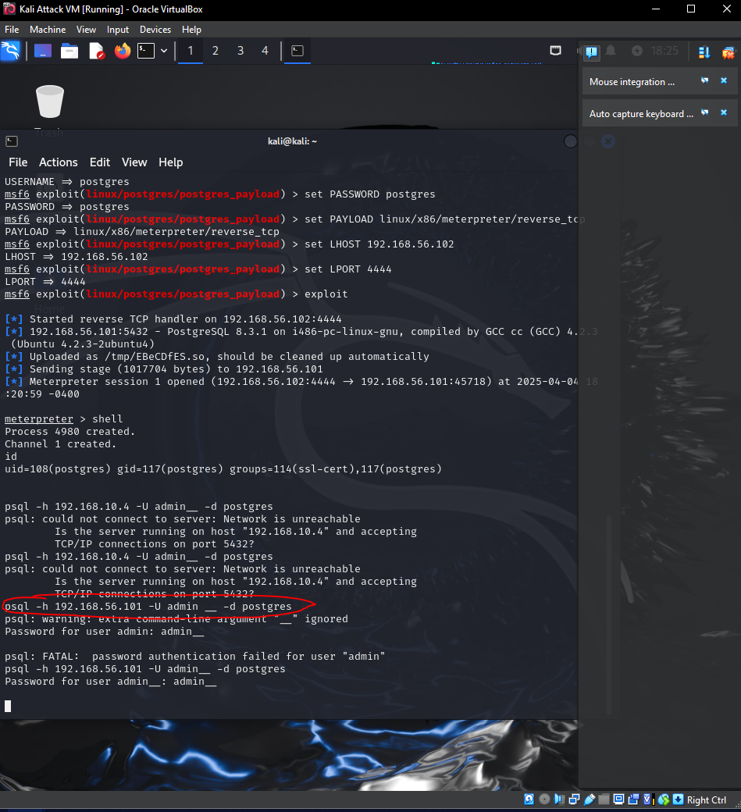

# **Assignment 3 Report**  
#### CSCI/CSCY 4743: Cyber and Infrastructure Defense, Spring 2025  

**Name & Student ID**: [Allen Lu], [109385233]  

**Please select your course number:**  
- [X] CSCI 4743  
- [ ] CSCY 4743  

---

# **Part 1: Conceptual Assignments**  

### **1. Cyber Kill Chain**  
#### **1.1 Describe the key stages of the Cyber Kill Chain and their significance.**  
*(Provide a detailed explanation of each stage and its role in a multi-stage attack.)*  

The Cyber Kill Chain is a model developed by Lockheed Martin to describe the stages of a cyberattack. It breaks down the attack into seven distinct phases, helping organizations understand and detect threats early in the lifecycle.

1. **Reconnaissance**  
   - *Description:* The attacker gathers information about the target, such as IP addresses, domain names, email addresses, employee information, and network configurations.  
   - *Significance:* This stage is crucial for planning an effective attack and identifying potential vulnerabilities.

2. **Weaponization**  
   - *Description:* The attacker creates a malicious payload (e.g., a virus or malware) and pairs it with a delivery mechanism such as a phishing email or an infected file.  
   - *Significance:* Weaponization prepares the tools needed to exploit the target once contact is made.

3. **Delivery**  
   - *Description:* The payload is transmitted to the victim via email attachments, malicious websites, USB drives, or other vectors.  
   - *Significance:* This is the stage where the attacker initiates contact with the target environment.

4. **Exploitation**  
   - *Description:* The attacker exploits a vulnerability in the target system (e.g., an outdated application) to execute the malicious code.  
   - *Significance:* This stage allows the attacker to breach system defenses and begin gaining control.

5. **Installation**  
   - *Description:* The malicious software installs itself on the victim’s system, enabling persistent access.  
   - *Significance:* It establishes a foothold for the attacker to maintain control even after reboots or user logouts.

6. **Command and Control (C2)**  
   - *Description:* The compromised system connects to an external server controlled by the attacker to receive commands.  
   - *Significance:* C2 allows the attacker to remotely manage the infected systems.

7. **Actions on Objectives**  
   - *Description:* The attacker performs actions to achieve their goals, such as data exfiltration, system disruption, or surveillance.  
   - *Significance:* This is the final step where the damage is actually done.

#### **1.2 Defense Strategies for Two Kill Chain Stages**  
**Stage 1: Reconnaissance**

- **Defense Strategy:**  
  Implement network intrusion detection systems (IDS) and honeypots to monitor for scanning and probing behavior. Utilize threat intelligence to detect early signs of interest from adversaries.

- **Real-World Example:**  
  A U.S. energy company detected early-stage reconnaissance through abnormal port scans coming from a foreign IP. By deploying honeypots and blocking the IPs at the firewall level, they prevented the attacker from gathering critical network details.

**Stage 4: Exploitation**

- **Defense Strategy:**  
  Regularly apply security patches, use endpoint protection, and enforce least-privilege access to minimize the impact of exploit attempts.

- **Real-World Example:**  
  The 2017 WannaCry ransomware exploited an unpatched SMB vulnerability (MS17-010). Organizations that had updated their systems with the patch were immune to the exploit and avoided significant data loss and downtime.

---

### **2. MITRE ATT&CK Framework**  
#### **2.1 Comparison of Cyber Kill Chain and MITRE ATT&CK**  
*(Discuss the key differences and how they complement each other in cybersecurity.)*  

The **Cyber Kill Chain** and **MITRE ATT&CK** frameworks are both essential tools in cybersecurity, but they differ in structure, scope, and approach.

| **Aspect**   | **Cyber Kill Chain**             | **MITRE ATT&CK**                               |
|--------------|----------------------------------|------------------------------------------------|
| **Structure**| Linear 7-stage model             | Matrix of Tactics and Techniques               |
| **Scope**    | High-level phases of an attack   | Detailed post-compromise behavior              |
| **Focus**    | Preventing intrusions early      | Understanding and detecting specific attacker techniques |
| **Use Case** | Strategic overview               | Tactical analysis and response                 |

**Complementarity:**  
The Cyber Kill Chain provides a **broad outline** of an attack's lifecycle, making it useful for **initial threat modeling** and high-level defense strategy. MITRE ATT&CK complements this by offering **detailed insights** into the **specific behaviors and techniques** used by attackers within each phase, enabling more **granular detection, investigation, and mitigation**. Together, they form a comprehensive framework for defending against threats from start to finish.

#### **2.2 Three MITRE ATT&CK Tactics and Techniques**  
**Tactic 1: Initial Access**
- **Technique:**  
  **Phishing: Spearphishing Attachment** – **T1566.001**  
  Adversaries craft emails with malicious attachments designed to trick recipients into opening them. These attachments often contain macro-enabled Office documents, PDFs with exploits, or executables disguised as legitimate files.

- **Defensive Measure:**  
  **User Training** and **Email Filtering**  
  Conduct security awareness training to help users identify phishing attempts. Deploy secure email gateways (SEGs) that scan attachments in a sandbox environment before delivery. These measures significantly reduce successful delivery and execution of malicious files.

**Tactic 2: Privilege Escalation**
- **Technique:**  
  **Exploitation for Privilege Escalation** – **T1068**  
  Adversaries exploit software vulnerabilities (e.g., unpatched OS or applications) to gain higher-level privileges on a system, allowing them to execute code with administrator or SYSTEM-level access.

- **Defensive Measure:**  
  **Patch Management and Vulnerability Scanning**  
  Regularly update software and systems to patch known vulnerabilities. Conduct vulnerability scans to identify and prioritize critical patches. This reduces the attack surface and blocks common exploit paths used for privilege escalation.

**Tactic 3: Persistence**
- **Technique:**  
  **Registry Run Keys / Startup Folder** – **T1547.001**  
  Attackers add values to Windows Registry Run keys or place programs in the Startup folder to automatically launch malware when the user logs in.

- **Defensive Measure:**  
  **Registry Monitoring and File Integrity Checking**  
  Implement monitoring for changes to key registry paths and the startup folder. Use endpoint detection and response (EDR) solutions to alert on abnormal additions. Early detection of persistence mechanisms helps neutralize threats before they can be leveraged.

---

### **3. Reconnaissance Techniques**  
#### **3.1 Active vs. Passive Reconnaissance**  
**Active Reconnaissance** involves direct interaction with the target system or network to gather information. This technique often includes activities like ping sweeps, port scanning, or vulnerability scanning. Because it interacts with the target, it is more likely to be detected by security systems.

- **Example:** Using Nmap to scan a target network for open ports and services.

**Passive Reconnaissance** involves collecting information without directly interacting with the target. Instead, attackers gather intelligence through publicly available sources, such as social media, public records, and search engines. Passive techniques are stealthy and harder to detect.

- **Example:** Searching LinkedIn for employee roles or using websites like WHOIS and Shodan to identify exposed assets.

#### **3.2 Tools for Reconnaissance**  
- **Active Reconnaissance Tool: Nmap**  
  Nmap (Network Mapper) is a widely used tool for scanning networks to identify live hosts, open ports, running services, and potential vulnerabilities.  
  - **Use Case Example:** An attacker uses Nmap to scan a web server and discovers that port 22 (SSH) is open and running an outdated version of OpenSSH, which may be exploitable.

- **Passive Reconnaissance Tool: Shodan**  
  Shodan is a search engine for internet-connected devices. It collects information from publicly available IPs without direct interaction, making it ideal for passive reconnaissance.  
  - **Use Case Example:** An attacker uses Shodan to find a company’s IoT devices or exposed webcams and discovers an unprotected device running a vulnerable version of a web interface.

#### **3.3 Transition from Reconnaissance to Exploitation**  
After gathering intelligence during the reconnaissance phase, attackers analyze the data to identify weaknesses they can exploit. This transition involves **weaponizing** the collected information to craft targeted attacks.

- For example, if reconnaissance reveals an outdated web server, the attacker may find a known exploit (e.g., CVE) and develop a payload to compromise it.
- If credentials or email formats are discovered, the attacker may launch a phishing campaign with tailored messages to increase success.

By leveraging the intelligence gained in reconnaissance, attackers can choose the most effective vectors for delivering malware or gaining unauthorized access, significantly increasing the chance of a successful breach.

---

### **4. Exploitation Techniques: Buffer Overflow vs. SQL Injection**  
**4.1 Comparison of Buffer Overflow and SQL Injection**  
| Feature               | Buffer Overflow                              | SQL Injection                                     |
|-----------------------|-----------------------------------------------|---------------------------------------------------|
| **Definition**        | Occurs when a program writes more data to a buffer than it can hold, causing memory corruption. | Occurs when malicious SQL statements are inserted into an input field to manipulate a database. |
| **Attack Vector**     | Executed by sending excessive input to a vulnerable program (e.g., through a network service). | Executed by injecting crafted SQL code via input fields such as login forms or search boxes. |
| **Impact**            | Can lead to arbitrary code execution, crashes, or privilege escalation. | Can lead to unauthorized access, data leakage, or complete database compromise. |
| **Typical Targets**   | System-level software, network services, binaries. | Web applications with poor input sanitization. |
| **Detection**         | Detected through memory analysis and behavior monitoring. | Detected through web traffic analysis and input validation checks. |
 

#### **4.2 Real-World CVE Examples**  
**Buffer Overflow Example**
- **CVE ID:** [CVE-2023-26083](https://nvd.nist.gov/vuln/detail/CVE-2023-26083)  
- **Vulnerability:** Linux kernel use-after-free vulnerability in the GPU driver.  
- **Impact:** Local users can execute arbitrary code with kernel privileges by triggering a buffer overflow condition.  
- **Exploitation Method:** Attackers exploit the flawed memory handling in the kernel driver to escalate privileges, potentially leading to full system compromise.

**SQL Injection Example**
- **CVE ID:** [CVE-2023-30630](https://nvd.nist.gov/vuln/detail/CVE-2023-30630)  
- **Vulnerability:** SQL injection vulnerability in WordPress plugin "Quiz and Survey Master" before version 8.0.5.  
- **Impact:** Allows unauthenticated users to execute arbitrary SQL queries via crafted HTTP requests.  
- **Exploitation Method:** Attackers exploit unsanitized input fields to extract sensitive data or modify the database structure.

#### **4.3 Importance of Patching and Input Validation**  
The examples above emphasize the critical need for:

- **Regular Patching:**  
  Timely updates help close known security gaps. CVEs are published frequently, and attackers often target unpatched systems soon after vulnerabilities are disclosed.

- **Input Validation:**  
  Implementing strict validation for all user inputs prevents injection attacks and other exploits. For example:
  - Use parameterized queries to prevent SQL injection.
  - Use bounds checking and memory-safe programming practices to avoid buffer overflows.

**Proactive security measures** like patch management and input validation form the first line of defense, reducing the attack surface and preventing exploitation before it begins.
 

---

### **5. Command & Control (C&C) Techniques**  
#### **5.1 Definition and Role of C&C**  
**Command and Control (C&C)** refers to the infrastructure and channels that allow cybercriminals to communicate with and control compromised systems (often referred to as "zombies" or "bots"). After gaining initial access to a network, adversaries establish a C&C channel to remotely manage and issue commands to the compromised machines. These channels enable attackers to:

- Maintain access to the victim system.
- Exfiltrate data.
- Deploy additional malware.
- Issue commands to spread laterally within the network or escalate privileges.

C&C channels play a critical role in allowing attackers to sustain an attack over time, adapt to changing conditions, and execute complex, multi-stage attacks.

#### **5.2 Traditional vs. Modern C&C Techniques**  

| Feature                    | **Traditional C&C (e.g., IRC-based botnets)**                 | **Modern C&C (e.g., HTTPS tunneling, DNS tunneling)**   |
|----------------------------|---------------------------------------------------------------|---------------------------------------------------------|
| **Protocol**               | IRC (Internet Relay Chat)                                    | HTTPS, DNS, peer-to-peer (P2P) protocols               |
| **Stealth**                | Less stealthy, as IRC traffic can be easily identified by network monitoring. | Highly stealthy, as HTTPS traffic appears as normal encrypted web traffic. DNS tunneling may seem like legitimate DNS requests. |
| **Effectiveness**          | Effective but easier to detect due to regular traffic patterns. | More difficult to detect due to the ability to blend with normal network traffic. |
| **Detection Challenges**   | Easily detectable with simple network traffic analysis, as IRC traffic can be monitored. | Much harder to detect; HTTPS traffic is encrypted, and DNS queries are often legitimate, making it difficult to distinguish malicious activity. |

**Example of Traditional C&C (IRC-based):**  
IRC-based botnets were used to send commands to infected systems, often through a central IRC server. Detecting such C&C was relatively easier through network traffic monitoring for irregular IRC communication patterns.

**Example of Modern C&C (HTTPS Tunneling):**  
In modern attacks, HTTPS tunneling is commonly used to send encrypted C&C traffic over port 443. This type of traffic blends seamlessly with legitimate web traffic, making detection difficult unless deep packet inspection (DPI) is applied.

#### **5.3 Detecting and Blocking C&C Traffic**  
Defenders can use various techniques to detect and block C&C traffic in a compromised network:

- **Anomaly-Based Detection:**  
  Anomaly-based detection systems monitor network traffic patterns and identify deviations from typical behavior. For example:
  - **DNS Anomalies:** Unusual or high volumes of DNS queries to uncommon domains may indicate DNS tunneling being used for C&C.
  - **HTTPS Traffic Analysis:** Unusual patterns, such as large volumes of encrypted traffic or communication with known malicious IPs, could indicate C&C activity.

- **Signature-Based Detection:**  
  Signature-based detection systems rely on predefined signatures of known C&C traffic patterns to identify malicious communication. This can include:
  - **Malicious Domains:** Blocking known malicious domains or IPs that are frequently associated with C&C traffic.
  - **Protocol Anomalies:** Identifying irregularities in protocol behavior, such as unauthorized IRC or DNS traffic, using predefined signatures.

- **Deep Packet Inspection (DPI):**  
  DPI tools analyze the payload of encrypted traffic (e.g., HTTPS) to detect the presence of C&C communication patterns that would otherwise be hidden. Although this is resource-intensive, it can uncover malicious activity within encrypted tunnels.

**Example Detection Tool:**  
Tools like **Zeek (formerly Bro)** and **Suricata** are capable of detecting and analyzing network anomalies. They can identify unusual DNS queries, detect traffic to suspicious IPs, and flag abnormal behavior indicative of C&C channels.

---

### **6. Lateral Movement and Persistence in Cyber Attacks**  
#### **6.1 Definition and Significance of Lateral Movement**  
**Lateral Movement** refers to the techniques attackers use to move within a compromised network, typically after the initial breach, to escalate privileges, access sensitive data, or expand their control over additional systems. Once attackers gain a foothold in a network, they move horizontally across systems to identify valuable targets or to elevate their access rights.

**Significance:**  
Lateral movement is crucial because it enables attackers to:
- **Escalate privileges** by targeting vulnerable systems or misconfigurations.
- **Expand their control** over the network, allowing them to access more sensitive or critical resources.
- **Avoid detection** by blending their actions with regular network traffic, making it more difficult for defenders to identify the full scope of the compromise.
 

#### **6.2 Common Lateral Movement Tactics**  
Attackers leverage lateral movement techniques to escalate privileges and expand their reach within a network. Some commonly used tactics include:

- **Pass-the-Hash (PtH):**  
  In this technique, attackers use stolen password hashes instead of plain-text passwords to authenticate to other systems without needing to crack the hashes.
  
  **Example:** After compromising an account on one machine, attackers can extract password hashes from the machine and use them to access other networked systems, often exploiting weak or reused passwords.

- **Remote Desktop Protocol (RDP):**  
  RDP is often exploited for lateral movement. Once attackers gain valid credentials, they use RDP to remotely control other systems and move deeper into the network.
  
  **Example:** An attacker might use RDP to access a high-privilege system (e.g., a server) after stealing administrative credentials.

- **WMI (Windows Management Instrumentation):**  
  WMI allows attackers to run commands on remote systems. This technique is often used to deploy malware or execute payloads across systems in a network.

  **Example:** Attackers can use WMI to execute malicious scripts remotely without alerting the victim system or leaving obvious traces.

#### **6.3 Persistence Techniques and Detection Methods**  
Adversaries use persistence techniques to maintain long-term access to compromised networks, allowing them to return even if their initial access point is discovered or patched.

**Persistence Technique 1: Registry Run Keys**
- **Description:**  
  Attackers can add values to the Windows Registry to ensure their malicious programs are executed upon system startup.
  
  **Detection Method:**  
  Security teams can implement **registry monitoring** to track changes to common persistence locations like `HKCU\Software\Microsoft\Windows\CurrentVersion\Run`. Any unauthorized changes should trigger alerts for further investigation.

**Persistence Technique 2: Scheduled Tasks**
- **Description:**  
  Attackers can create scheduled tasks that run malicious code at specified times, often to ensure persistence after reboots or logins.
  
  **Detection Method:**  
  **Task Scheduler logs** should be continuously monitored for unusual task creation or modifications. Security tools can be configured to alert if tasks are created with suspicious parameters or if unexpected executables are scheduled to run.

---

### **7. Case Study: CuttingEdge Campaign**  
**7.1 Reconnaissance Methods Used in CuttingEdge**  
The **Cutting Edge campaign**, identified as **Campaign ID C0029**, was conducted by suspected China-nexus espionage actors, including groups such as **UNC5221/UTA0178** and **UNC5325**. The campaign began as early as **December 2023** and targeted sectors including the **U.S. defense industrial base**, **telecommunications**, **financial**, **aerospace**, and **technology** industries.  

**Reconnaissance Methods:**
- **Active Scanning:** The attackers employed tools like **Interactsh** to actively scan for vulnerabilities in Ivanti Connect Secure (formerly Pulse Secure) VPN appliances. These appliances were found to have a zero-day vulnerability, **CVE-2024-21893**, which the attackers exploited in later stages.  
- **OSINT (Open Source Intelligence):** Attackers also leveraged publicly available information and weakly secured network devices to gather intelligence on vulnerable targets.

#### **7.2 Exploitation Techniques in CuttingEdge**  
The **Cutting Edge** campaign leveraged vulnerabilities in **Ivanti Connect Secure** and **Cyberoam VPN** appliances to gain unauthorized access.  
**Exploitation Techniques:**
- **Zero-Day Vulnerability (CVE-2024-21893):** The attackers exploited a zero-day vulnerability in Ivanti Connect Secure to execute arbitrary commands on the targeted systems. This vulnerability was used to establish the initial access point in the network.
- **Exploitation of Outdated Software:** The campaign also targeted outdated Cyberoam VPN appliances, exploiting them for further persistence and control.

**Leveraged Vulnerabilities:**
- **Ivanti Connect Secure (Pulse Secure) VPN Zero-Day:** Allowed attackers to execute arbitrary code on the VPN appliances, facilitating initial access.
- **Cyberoam VPN Exploit:** Attackers also used this appliance to establish C&C channels, expanding the scope of the attack.

#### **7.3 Command & Control Techniques Used**  
Attackers in the Cutting Edge campaign employed sophisticated **Command & Control (C&C)** techniques to maintain communication and control over compromised systems.  
**C&C Techniques:**
- **DNS Tunneling:** Attackers used **DNS tunneling** to bypass network defenses and maintain covert communication with compromised systems. DNS requests were manipulated to tunnel IPv4 C&C traffic, making the communication blend with legitimate DNS traffic and evade detection.
- **Use of Custom Malware and Web Shells:** Attackers deployed custom malware and web shells on the compromised devices, enabling continuous access to the network and facilitating remote control.

#### **7.4 Defensive Strategies**  
Here are proposed defensive strategies for each stage of the Cutting Edge campaign:

**Reconnaissance Defense Strategy:**
- **Network Segmentation and Restrictive Access:** By segmenting the network and implementing strict access controls, organizations can reduce the surface area for reconnaissance activities. Regular network scanning and vulnerability assessments should be conducted to identify exposed devices.
- **Security Tool Implementation:** Deploy intrusion detection systems (IDS) that can detect unusual scanning patterns or reconnaissance activities.

**Exploitation Defense Strategy:**
- **Patch Management and Vulnerability Scanning:** Regular patching and vulnerability scanning are crucial to address known vulnerabilities, such as the Ivanti Connect Secure zero-day. Automated patch management systems should be in place to ensure timely updates.
- **Web Application Firewalls (WAFs):** Implement WAFs to block exploit attempts against web-facing applications and VPN systems.

**C&C Defense Strategy:**
- **DNS Traffic Monitoring and Blocking:** Organizations should implement continuous monitoring of DNS traffic to identify anomalies indicative of DNS tunneling. Configuring DNS filtering can help block access to known malicious domains.
- **Behavioral Analysis for C&C Traffic:** Use network monitoring tools that conduct deep packet inspection (DPI) to identify and flag unusual encrypted traffic or traffic patterns typical of C&C communication.

---

### **8. CVSS-Based Vulnerability Assessment**  
#### **8.1 CVSS Calculation for Unauthorized Database Access**  
**Scenario Overview:**  
A cloud-hosted database contains sensitive customer information, including PII (Personally Identifiable Information). A flaw in the application’s API allows attackers to bypass authentication and query the database directly over the internet.

**CVSS Metrics:**

- **Attack Vector (AV):** Network (N)  
  *Justification:* The attack can be carried out remotely over the internet, targeting the cloud-hosted database exposed to the public network.

- **Attack Complexity (AC):** Low (L)  
  *Justification:* The vulnerability can be exploited with no authentication and without user interaction. Attackers can directly query the database, making the attack simple to execute.

- **Privileges Required (PR):** None (N)  
  *Justification:* The vulnerability does not require any credentials or privilege to exploit, as it allows direct access to the database.

- **User Interaction (UI):** None (N)  
  *Justification:* No user interaction is required, as the flaw is in the API and can be exploited remotely without any need for user involvement.

**Impact Metrics:**

- **Confidentiality Impact (C):** High (H)  
  *Justification:* The attacker can gain full access to sensitive customer data, including Personally Identifiable Information (PII), which directly impacts confidentiality.

- **Integrity Impact (I):** None (N)  
  *Justification:* The attack does not allow write or delete operations, meaning the integrity of the data is not affected.

- **Availability Impact (A):** None (N)  
  *Justification:* The attack does not affect the availability of the database or its services.

**Base Score Calculation:**  
Using the CVSS 3.1 Calculator, the Base Score for this vulnerability is **9.8** (Critical).

#### **8.2 CVSS Calculation for Privilege Escalation on Internal Server**  
**Scenario Overview:**  
A vulnerability in a file-sharing server allows local authenticated users to escalate their privileges to a superuser account. This vulnerability requires user-level access to the internal server and involves a series of commands to exploit.

**CVSS Metrics:**

- **Attack Vector (AV):** Local (L)  
  *Justification:* The attacker must have local access to the system, and the vulnerability can only be exploited from within the internal network.

- **Attack Complexity (AC):** Low (L)  
  *Justification:* The exploitation of this vulnerability is straightforward, as the required steps are well-documented and do not require complex techniques.

- **Privileges Required (PR):** Low (L)  
  *Justification:* The attacker needs user-level access to exploit the vulnerability, but no elevated privileges are required to begin the attack.

- **User Interaction (UI):** None (N)  
  *Justification:* The vulnerability can be exploited without any additional user interaction, once the attacker has local access.

**Impact Metrics:**

- **Confidentiality Impact (C):** High (H)  
  *Justification:* After privilege escalation, the attacker can access sensitive files and data, compromising the confidentiality of the server.

- **Integrity Impact (I):** High (H)  
  *Justification:* The attacker gains full control over the server and its files, allowing them to modify or delete important data, impacting the integrity.

- **Availability Impact (A):** Low (L)  
  *Justification:* The availability of the server itself may not be directly affected by the attack, but the files on the server could be altered, potentially causing service disruptions.

**Base Score Calculation:**  
Using the CVSS 3.1 Calculator, the Base Score for this vulnerability is **7.8** (High).

#### **8.3 Comparative Analysis and Risk Assessment**  
**Ranking by Severity:**  
1. **Unauthorized Database Access (Base Score: 9.8 - Critical)**  
2. **Privilege Escalation on Internal Server (Base Score: 7.8 - High)**  

**Risk Discussion:**

- **Unauthorized Database Access** presents a **Critical risk**, as it involves sensitive PII and could lead to data breaches, financial loss, and reputational damage. Since the vulnerability is exploitable remotely and doesn't require authentication, it is highly accessible to attackers, making it a severe threat to organizations.
  
- **Privilege Escalation on Internal Server** poses a **High risk** but is limited by the fact that the attacker needs local access to the system, reducing the attack surface. While this vulnerability could result in significant damage to confidentiality and integrity, it is less immediately accessible compared to the database flaw.

**Greatest Organizational Risk:**  
The **Unauthorized Database Access** vulnerability poses the greatest risk, primarily because of its remote exploitability and the high sensitivity of the data exposed. Organizations should prioritize patching this type of vulnerability to avoid large-scale data breaches and compliance issues, particularly concerning PII.

---

# **Part 2: Conducting a Cyber Intrusion**  

## **Section 1: Network Reconnaissance**  

#### **Screenshots**  
- `netdiscover` results  

- `nmap -sS` scan results  

- `nmap -sV` version detection results  

#### **Response to Analysis Questions**    

1️⃣ What does `netdiscover` do, and what protocol does it use?  
- **Netdiscover** is a tool used for network discovery, which scans the network to find live hosts by listening for **ARP (Address Resolution Protocol)** requests and replies. It identifies devices in a given network range and displays their IP addresses and associated MAC addresses. The protocol it primarily uses for this is **ARP**.

2️⃣ What is the **IP address of Metasploitable 2 (M2)** in your network?  
- Based on the **netdiscover** output, the IP address of **Metasploitable 2** (M2) is **192.168.56.101**.

3️⃣ Based on your Nmap scan, list all open ports on M2.  
- The open ports identified in the **Nmap -sS** scan for **M2 (192.168.56.101)** are:
  - **21/tcp** (FTP)
  - **22/tcp** (SSH)
  - **23/tcp** (Telnet)
  - **25/tcp** (SMTP)
  - **53/tcp** (DNS)
  - **80/tcp** (HTTP)
  - **111/tcp** (RPCbind)
  - **139/tcp** (NetBIOS-SSN)
  - **445/tcp** (Microsoft-DS)
  - **512/tcp** (Exec)
  - **513/tcp** (Login)
  - **514/tcp** (Shell)
  - **1099/tcp** (RMI Registry)
  - **1524/tcp** (Ingreslock)
  - **2049/tcp** (NFS)
  - **2121/tcp** (CCProxy-FTP)
  - **3306/tcp** (MySQL)
  - **5432/tcp** (PostgreSQL)
  - **5900/tcp** (VNC)
  - **6000/tcp** (X11)
  - **6667/tcp** (IRC)
  - **8009/tcp** (AJP13)
  - **8180/tcp** (Unknown)
  
4️⃣ What is the most dangerous open service on the target? Justify your answer.
- The **most dangerous open service** on the target is **port 1524/tcp (Ingreslock)**. This port is used by **Metasploitable 2** for a **root shell**, which gives attackers complete control over the system. This is critical because an attacker exploiting this vulnerability could easily escalate privileges and fully compromise the system. 
  
5️⃣ What version of **Postgresql** is running on M2?  
- Based on the **Nmap -sV** version detection, **PostgreSQL** on **M2** is running version **8.3.0 - 8.3.7**.

6️⃣ Why is **version detection** important in penetration testing?
- **Version detection** is crucial in penetration testing because it helps identify known vulnerabilities associated with specific software versions. By knowing the version, an attacker can look up the version in vulnerability databases like **CVE** (Common Vulnerabilities and Exposures) to find exploits tailored for that version, making attacks more effective and efficient.

7️⃣ List and rank the top 3 services.  
- Based on attack potential, the top 3 services are:
  1. **Port 1524 (Ingreslock)** - Provides a root shell, granting attackers complete control.
  2. **Port 21 (FTP)** - FTP is often used to transfer files, and misconfigurations like weak credentials could lead to unauthorized access.
  3. **Port 22 (SSH)** - SSH is used for secure communication, but weak passwords or known exploits could allow attackers to gain remote access.

8️⃣ Briefly justify your choices based on attack potential.
- **Port 1524 (Ingreslock)** is the most critical because it provides a root shell, which gives full control over the system. **Port 21 (FTP)** and **Port 22 (SSH)** can also be exploited, especially if weak authentication is used or services are misconfigured, enabling attackers to gain unauthorized access.

9️⃣ Summarize the scan output.  
- The **Nmap** scan on **Metasploitable 2** revealed a significant number of open ports, including common services like **FTP**, **SSH**, **HTTP**, and **MySQL**. Several of these services are outdated or misconfigured, presenting multiple potential attack vectors. The machine is likely vulnerable to various exploits, especially given its age and the open services.

🔟 Were any known vulnerabilities or warnings reported?  
- **Nmap** did not specifically report any vulnerabilities, but based on the open ports and their associated services (such as **Ingreslock** on port 1524), known vulnerabilities exist for many of the services, such as FTP, MySQL, and PostgreSQL. Further research into specific CVEs for each service would reveal known exploits.

1️⃣1️⃣ How could this information guide a future attack?
- This information provides critical insight into the **Metasploitable 2** machine's weaknesses. An attacker could use **Nmap's version detection** results to identify vulnerabilities in services like **PostgreSQL**, **MySQL**, and **FTP**. Additionally, knowing the open ports and their associated services allows the attacker to focus on the most exploitable ones, such as **Ingreslock**, for gaining root access. This scan results in a more targeted and efficient attack strategy.

---

## **Section 2: PostgreSQL Exploitation, Persistence, and Defense Evasion**  

#### **Screenshots**  
- `nmap -sV -p 5432` PostgreSQL service detection  

- PostgreSQL login attempt using default credentials (`psql -h <MS-2-IP> -U postgres`)  

- Metasploit exploitation session (`meterpreter` shell)  

- Backdoor user creation command (`psql -U postgres -c "CREATE ROLE ..."`) 

 
- Login attempt using backdoor account (`psql -U admin__ -W`)  

- Privilege escalation via Nmap (`nmap --interactive`, `bash -p`, `whoami`)  

- Log file before and after clearing (`last` and `/var/log/wtmp`)  

---

### **Response to Analysis Questions**  

1️⃣ Were you able to connect with **default PostgreSQL credentials**?  
- **YES**

2️⃣ What privileges does the `postgres` user have?  
- The postgres user has superuser privileges (rolsuper == t).

3️⃣ What happens when the Metasploit PostgreSQL exploit runs successfully?  
When the exploit runs successfully:
- Meterpreter payload is executed on the target system (Metasploitable 2).
- A reverse connection is made to your Kali machine.
- A Meterpreter session is established, granting you remote code execution and full control over the target system.

4️⃣ What privileges do you have after exploitation?  
- After exploitation, you have postgres user privileges. The id command shows that you are running as the postgres user with the following privileges:
- UID: 108 (postgres)
- GID: 117 (postgres)
- Group memberships: ssl-cert, postgres
- You have limited access based on the privileges of the postgres user. However, since the postgres user is a superuser in PostgreSQL, you can escalate privileges within the database system if needed.

5️⃣ Were you able to create a backdoor PostgreSQL superuser? What command did you use?  
- **Yes**, I was able to create a backdoor PostgreSQL superuser.  
- The command I used was:  

  psql -U postgres -c "CREATE ROLE admin__ WITH SUPERUSER LOGIN PASSWORD 'admin__';"
  
6️⃣ Were you able to log in using the new backdoor account?  

- **Yes**, I was able to log in using the newly created backdoor account.  
- The command I used to log in was:
  psql -h 192.168.10.4 -U admin__ -d postgres
  
7️⃣ What technique did you use to escalate privileges to root?  
- I used a **misconfigured binary** (`/usr/bin/nmap`) with the **setuid bit** set. This allowed me to escalate privileges to root.  
- The command to enter Nmap’s interactive mode was:
  nmap --interactive
  
8️⃣ Did the privilege escalation exploit grant full root access?  
- **Yes**, the privilege escalation exploit granted **full root access**.  
- I confirmed this by running the `whoami` command, which returned `root`.

9️⃣ Why do attackers erase logs during or after an intrusion?  
- **Attackers erase logs** to **cover their tracks** and avoid detection.  
- By clearing the logs, they make it difficult for security teams to trace their actions, understand the timeline of the intrusion, and attribute the attack to specific individuals.  
- This is a key part of maintaining **persistence** and **avoiding identification** during and after an attack.

🔟 Show the output of `last` before and after clearing `/var/log/wtmp`. What changed?  
- What changed:
- Before clearing, the last command showed recent login sessions, including the usernames, login times, and IP addresses.
- After clearing /var/log/wtmp, the last command displayed no entries, as the log file was erased and no records remained.

1️⃣1️⃣ What security measures can detect or prevent log tampering?

1. **File Integrity Monitoring (FIM)**:
   - Tools like AIDE, OSSEC, or Tripwire monitor changes in log files and alert administrators if any unauthorized modifications are detected.
   
2. **Immutable Logs**:
   - Using tools like `chattr` in Linux to set logs as immutable, preventing unauthorized users or processes from altering log files.

3. **Centralized Logging Systems**:
   - Solutions like the ELK stack (Elasticsearch, Logstash, Kibana) or SIEM systems (e.g., Splunk, Graylog) help monitor logs in real-time, providing the ability to detect anomalies and unauthorized changes.
   
4. **Log Rotation with Compression**:
   - Regular log rotation and compression prevent logs from being overwritten or tampered with, making it easier to preserve historical log data.

5. **Access Control and Auditing**:
   - Restricting access to log files by using proper file permissions and auditing the activities of users with access to sensitive logs can help prevent tampering.

6. **Intrusion Detection Systems (IDS)**:
   - IDS systems (e.g., Snort, Suricata) can alert on suspicious activity, such as attempts to delete or alter logs.
   
7. **Syslog Servers with Encryption**:
   - Sending logs to a centralized and secured syslog server with encrypted channels ensures that logs cannot be tampered with while in transit or storage.

8. **Regular Auditing and Log Review**:
   - Implementing routine log reviews and audits allows the detection of discrepancies or tampering that might have occurred during an intrusion.

